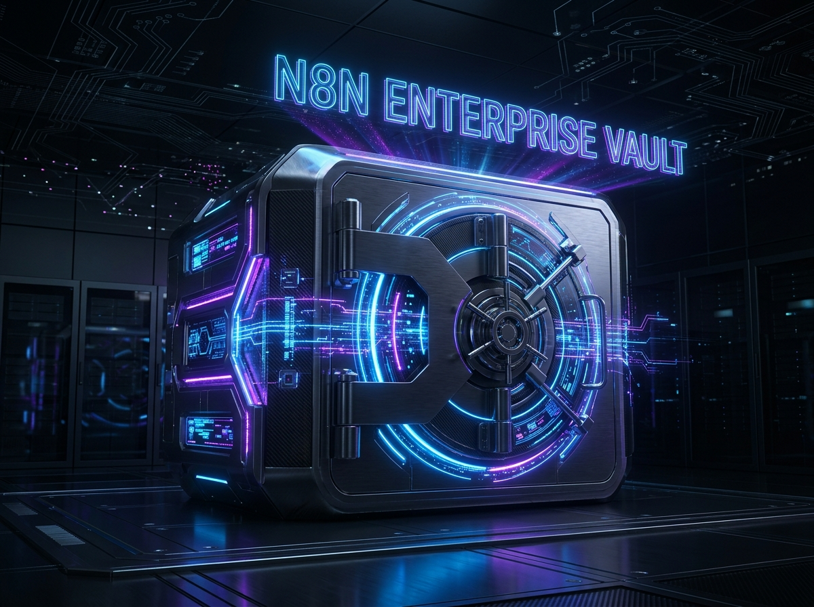

# Apollo AGI ISO: Enterprise n8n Automations 🚀

Welcome to the **Apollo AGI ISO** open-source repository. We design brutalist, high-performance automation blueprints for CTOs, RevOps, and engineering teams.

## 🔓 Free Point-Solutions (Community Edition)

This repository contains 3 standalone, production-ready n8n workflows that you can copy and deploy immediately:

### 1. 🎙️ Meeting Distiller (`01_FREE_MEETING_DISTILLER`)
Automatically extracts actionable intelligence, decisions, and tasks from raw meeting transcripts.

### 2. 🎯 LinkedIn Sniper (`02_FREE_LINKEDIN_SNIPER`)
B2B lead enrichment pipeline. Scrapes and structures LinkedIn data for hyper-targeted outreach.

### 3. 💻 GitHub PR Reviewer (`03_FREE_GITHUB_PR_REVIEWER`)
Automated code review and security auditing for Pull Requests using LLMs.

---

## 🔒 Upgrade to The Enterprise Core (ISO 27001 Standard)

The free nodes above are just a fraction of our capability. If you are building a serious, scalable infrastructure, you need **The Genesis Core**. 

Unlock the full **N8N_ENTERPRISE_VAULT_CORE** for **$96**. 

### What's inside the Vault?
* **9 Enterprise-Grade Workflows** (Including RAG Document Sync, Rate Limiting Firewalls, and Stripe RevOps).
* **Hardened Security:** Engineered for strict credential isolation, data minimization, and ISO compliance readiness.
* **Instant ROI:** Automations that replace full-time agency retainers.

🔥 **[Click Here to Access the Enterprise Vault ($96)](https://apollo-agi-iso.lemonsqueezy.com/checkout/buy/b7ac6b3e-ddf1-4cec-a73d-2d9e4fad01e3)**

---
*Built with precision by Apollo AGI ISO. Friction = 0.*
